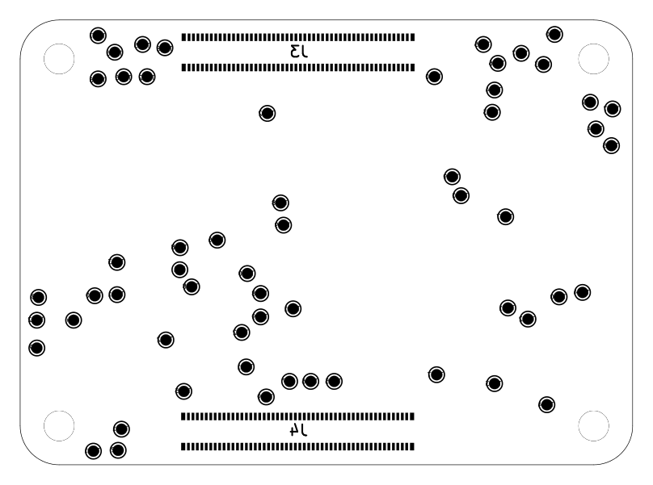

# CM5 Test Point Breakout

Sveden projekt za KiCad izveden iz obratno projektirane ploče Raspberry Pi Compute Module 5 ([schlae/cm5-reveng](https://github.com/schlae/cm5-reveng), CC BY-SA 4.0, autor Tube Time).

Sadrži **samo** ono što treba za pristup mjernim točkama modula:

| Element                        | Količina | Sloj         | Napomena                                                       |
|--------------------------------|----------|--------------|----------------------------------------------------------------|
| Test-točke `TP*`               | 58       | B.Cu (donji) | pad promjera 1,0 mm                                            |
| Konektori modula `J3`, `J4`    | 2        | B.Cu (donji) | Amphenol 10164228-1001A1RLF, 2 × 100 nožica + 4 mehanička pada |
| Rupe za pričvršćenje `H1`–`H4` | 4        | kroz ploču   | raspored 48,0 × 33,0 mm                                        |
| Obris ploče `Edge.Cuts`        | 8 crta   | –            | 55,00 × 40,00 mm, zaobljeni kutovi                             |

Vodovi, zone, ostale sastavnice i unutarnji slojevi izostavljeni su. Geometrija je preuzeta **1:1**, pa se položaji poklapaju s pravim modulom.



*Donji sloj: 58 test-točaka, konektori J3 (gore) i J4 (dolje), četiri rupe u uglovima. Natpisi J3/J4 zrcaljeni su jer su na donjem sloju.*

## Datoteke

```
cm5_tp_breakout.kicad_pro      projekt
cm5_tp_breakout.kicad_sch      korijenska shema (tri lista)
  testpoints.kicad_sch         58 test-točaka, opis uz svaku
  cm5_connectors.kicad_sch     J3 i J4 sa svim imenima mreža
  mechanical.kicad_sch         H1-H4
cm5_tp_breakout.kicad_pcb      ploča (dva sloja)
cm5_tp_breakout.kicad_sym      simboli (TestPoint, CM5_Conn_100P, MountingHole)
cm5_tp_breakout.pretty/        footprinti (izvezeni iz izvorne ploče)
doc/                           izvezena shema u PDF-u
tools/                         generator — projekt se može ponovno izgraditi iz izvornika
```

Projekt je samostalan: simboli i footprinti nalaze se u projektnim knjižnicama, pa ne treba nijedna vanjska knjižnica.

## Test-točke

Koordinate su u milimetrima od **donjega lijevog kuta ploče**, u KiCadovu pogledu odozgo (X udesno, Y prema gore). Točke su na donjem sloju, pa su pri pogledu odozdo zrcaljene po osi X.

`Oznaka` je natpis s izvorne ploče, `Mreža` je ime mreže u shemi, `Na konektoru` navodi nožice J3/J4 koje su na istoj mreži.

### Napajanje

| TP     | Oznaka       | Mreža            | Nazivno | X \[mm\] | Y \[mm\] | Na konektoru                             | Opis                                                                                                               |
|--------|--------------|------------------|---------|---------:|---------:|------------------------------------------|--------------------------------------------------------------------------------------------------------------------|
| `TP63` | 5V_SENSE     | `+5V`            | 5,0 V   |     8,70 |    18,20 | –                                        | 5 V iza sklopke s ograničenjem struje u PMIC-u DA9091; na ploči označeno 5V_SENSE — mjerna točka, ne opterećivati. |
| `TP1`  | 5V           | `+5VIN`          | 5,0 V   |    14,34 |    17,54 | J3-77, J3-79, J3-81, J3-83, J3-85, J3-87 | Ulazno napajanje modula s nosive ploče, prije sklopke PMIC-a (J3, nožice 77–87).                                   |
| `TP78` | 5V           | `+5VIN`          | 5,0 V   |    14,37 |    19,52 | J3-77, J3-79, J3-81, J3-83, J3-85, J3-87 | Ulazno napajanje modula s nosive ploče, prije sklopke PMIC-a (J3, nožice 77–87).                                   |
| `TP34` | CM5_1V8      | `CM5_1V8`        | 1,8 V   |    50,50 |    15,50 | J3-88, J3-90                             | Sabirnica 1,8 V modula izvedena na konektor (J3, nožice 88 i 90).                                                  |
| `TP33` | CM5_3V3      | `CM5_3V3`        | 3,3 V   |    47,00 |    36,00 | J3-84, J3-86                             | Sabirnica 3,3 V modula izvedena na konektor (J3, nožice 84 i 86).                                                  |
| `TP64` | VDD_1V0_PHY  | `ETHPHY_U4_VREG` | –       |    47,30 |     5,40 | –                                        | Izlaz unutarnjega regulatora ethernetskoga PHY-ja BCM54210PE (U4), nožica VREG; na ploči označeno VDD_1V0_PHY.     |
| `TP77` | GPIO_VREF    | `GPIO_VREF`      | 3,3 V   |    45,00 |    37,00 | J3-78                                    | Referentni napon skupine GPIO na RP1; određuje logičke razine (J3, nožica 78).                                     |
| `TP30` | 0V6          | `VDD_0V6`        | 0,6 V   |    37,20 |    34,90 | –                                        | VDDQ za LPDDR4X (U2) iz PMIC-a; osjetljivo na šum i pad napona.                                                    |
| `TP29` | VDD_0V8_BCM  | `VDD_0V8_BCM`    | 0,8 V   |    23,65 |    21,55 | –                                        | Pomoćna sabirnica 0,8 V za BCM2712.                                                                                |
| `TP15` | VDD_0V8_LDO  | `VDD_0V8_LDO`    | 0,8 V   |    14,70 |     6,60 | –                                        | Izlaz linearnoga regulatora 0,8 V (niskošumni dio).                                                                |
| `TP31` | 1V1          | `VDD_1V1`        | 1,1 V   |     9,10 |     3,20 | –                                        | Sabirnica 1,1 V (VDD1 memorije LPDDR4X i logika).                                                                  |
| `TP27` | VDD_1V1_RP1  | `VDD_1V1_RP1`    | 1,1 V   |    43,60 |    22,30 | –                                        | Jezgreno napajanje 1,1 V za ulazno-izlazni most RP1.                                                               |
| `TP45` | VDD_1V1_RP1  | `VDD_1V1_RP1`    | 1,1 V   |    53,10 |    28,70 | –                                        | Jezgreno napajanje 1,1 V za ulazno-izlazni most RP1.                                                               |
| `TP18` | VDD_1V8_2    | `VDD_1V8_2`      | 1,8 V   |    23,40 |    23,55 | –                                        | Druga grana 1,8 V (ulazi/izlazi i memorija).                                                                       |
| `TP44` | VDD_2V5_RP1  | `VDD_2V5_RP1`    | 2,5 V   |    51,70 |    30,20 | –                                        | Napajanje 2,5 V analognoga dijela RP1 (PLL i PHY).                                                                 |
| `TP17` | VDD_3V3_2    | `VDD_3V3_2`      | 3,3 V   |    37,40 |     8,10 | –                                        | Druga grana 3,3 V (ulazi/izlazi).                                                                                  |
| `TP32` | VDD_3V7_WIFI | `VDD_3V7_WIFI`   | 3,7 V   |     1,50 |    13,00 | –                                        | Napajanje modula WiFi/Bluetooth RP1-RM0 (U7).                                                                      |
| `TP28` | VDD_BCM_CORE | `VDD_BCM_CORE`   | ~0,8 V  |    15,40 |    16,00 | –                                        | Jezgreno napajanje SoC-a BCM2712; napon se mijenja s opterećenjem (DVFS).                                          |
| `TP9`  | VREF_3V3     | `VREF_3V3`       | 3,3 V   |     1,50 |    10,50 | –                                        | Referentnih 3,3 V (djelitelj napona, ne opterećivati).                                                             |
| `TP10` | VREG         | `VREG`           | –       |    48,40 |    15,10 | –                                        | Izlaz unutarnjega regulatora PMIC-a DA9091; mjerna točka, ne napajanje.                                            |

### Masa

| TP     | Oznaka | Mreža | Nazivno | X \[mm\] | Y \[mm\] | Na konektoru                         | Opis                                                           |
|--------|--------|-------|---------|---------:|---------:|--------------------------------------|----------------------------------------------------------------|
| `TP3`  | GND    | `GND` | 0 V     |    51,20 |    32,60 | J3-1, J3-2, J3-7, J3-8, J3-13, J3-14 | Masa. Referentna točka za sva mjerenja; devet točaka po ploči. |
| `TP7`  | GND    | `GND` | 0 V     |    24,20 |     7,50 | J3-1, J3-2, J3-7, J3-8, J3-13, J3-14 | Masa. Referentna točka za sva mjerenja; devet točaka po ploči. |
| `TP8`  | GND    | `GND` | 0 V     |     1,65 |    15,05 | J3-1, J3-2, J3-7, J3-8, J3-13, J3-14 | Masa. Referentna točka za sva mjerenja; devet točaka po ploči. |
| `TP13` | GND    | `GND` | 0 V     |    42,60 |     7,30 | J3-1, J3-2, J3-7, J3-8, J3-13, J3-14 | Masa. Referentna točka za sva mjerenja; devet točaka po ploči. |
| `TP26` | GND    | `GND` | 0 V     |    17,70 |    20,20 | J3-1, J3-2, J3-7, J3-8, J3-13, J3-14 | Masa. Referentna točka za sva mjerenja; devet točaka po ploči. |
| `TP46` | GND    | `GND` | 0 V     |     7,00 |    34,70 | J3-1, J3-2, J3-7, J3-8, J3-13, J3-14 | Masa. Referentna točka za sva mjerenja; devet točaka po ploči. |
| `TP60` | GND    | `GND` | 0 V     |    48,00 |    38,70 | J3-1, J3-2, J3-7, J3-8, J3-13, J3-14 | Masa. Referentna točka za sva mjerenja; devet točaka po ploči. |
| `TP61` | GND    | `GND` | 0 V     |     6,58 |     1,23 | J3-1, J3-2, J3-7, J3-8, J3-13, J3-14 | Masa. Referentna točka za sva mjerenja; devet točaka po ploči. |
| `TP62` | GND    | `GND` | 0 V     |    22,20 |    31,60 | J3-1, J3-2, J3-7, J3-8, J3-13, J3-14 | Masa. Referentna točka za sva mjerenja; devet točaka po ploči. |

### Upravljanje i pokretanje

| TP     | Oznaka     | Mreža          | Nazivno | X \[mm\] | Y \[mm\] | Na konektoru | Opis                                                                                                                 |
|--------|------------|----------------|---------|---------:|---------:|--------------|----------------------------------------------------------------------------------------------------------------------|
| `TP4`  | PMIC_INT   | `PMIC_INT`     | 3,3 V   |     4,80 |    13,00 | –            | Zahtjev za prekid iz PMIC-a DA9091 prema BCM2712 (djelatan niskom razinom).                                          |
| `TP39` | EN_LOAD_SW | `PWRSW_U10_ON` | –       |    22,10 |     6,10 | –            | Ulaz ON sklopke napajanja SLG59M1446V (U10); na ploči označeno EN_LOAD_SW, visoka razina znači uključenu sklopku.    |
| `TP42` | PWR_BUT    | `PWR_BUT`      | 3,3 V   |    11,40 |    34,90 | J3-92        | Tipka napajanja prema PMIC-u; kratki spoj na masu budi ili gasi modul.                                               |
| `TP2`  | RUN        | `RUN`          | 3,3 V   |     8,80 |     1,30 | –            | Opći ponovni postav (djelatan niskom razinom, s otporom prema napajanju). Kratki spoj na masu ponovno pokreće modul. |
| `TP21` | nRESET_OUT | `nRESET_OUT`   | 3,3 V   |    24,51 |    14,03 | –            | Izlazni ponovni postav prema sklopovlju nosive ploče; niska razina dok modul nije spreman.                           |
| `TP16` | nRPIBOOT   | `nRPIBOOT`     | 3,3 V   |     9,30 |    34,90 | J3-93        | Niska razina pri uključenju pokreće modul s USB-a (rpiboot) umjesto s eMMC-a.                                        |

### Otklanjanje pogrešaka (JTAG/UART)

| TP     | Oznaka        | Mreža           | Nazivno | X \[mm\] | Y \[mm\] | Na konektoru | Opis                                            |
|--------|---------------|-----------------|---------|---------:|---------:|--------------|-------------------------------------------------|
| `TP36` | DEBUG_UART_RX | `DEBUG_UART_RX` | 3,3 V   |     8,50 |    37,10 | –            | Serijska konzola, ulaz u modul.                 |
| `TP35` | DEBUG_UART_TX | `DEBUG_UART_TX` | 3,3 V   |    11,00 |    37,80 | –            | Serijska konzola, izlaz iz modula (115200 8N1). |
| `TP52` | SOC_TCK       | `SOC_TCK`       | 3,3 V   |    19,90 |    11,90 | –            | Takt JTAG prema BCM2712.                        |
| `TP49` | SOC_TDI       | `SOC_TDI`       | 3,3 V   |    21,60 |    13,30 | –            | Ulaz podataka JTAG.                             |
| `TP50` | SOC_TDO       | `SOC_TDO`       | 3,3 V   |    20,40 |    17,20 | –            | Izlaz podataka JTAG.                            |
| `TP51` | SOC_TMS       | `SOC_TMS`       | 3,3 V   |    20,30 |     8,80 | –            | Odabir načina rada JTAG.                        |
| `TP48` | SOC_TRST_N    | `SOC_TRST_N`    | 3,3 V   |    21,60 |    15,40 | –            | Ponovni postav JTAG (djelatan niskom razinom).  |

### Sabirnica I2C prema PMIC-u

| TP     | Oznaka   | Mreža          | Nazivno | X \[mm\] | Y \[mm\] | Na konektoru | Opis                                                              |
|--------|----------|----------------|---------|---------:|---------:|--------------|-------------------------------------------------------------------|
| `TP40` | PMIC_SCL | `PMIC_I2C.SCL` | 3,3 V   |     6,70 |    15,20 | –            | Takt sabirnice I2C prema PMIC-u DA9091 — put do registara PMIC-a. |
| `TP41` | PMIC_SDA | `PMIC_I2C.SDA` | 3,3 V   |     8,70 |    15,30 | –            | Podatci sabirnice I2C prema PMIC-u DA9091.                        |

### Ethernet 1000BASE-T

| TP     | Oznaka | Mreža     | Nazivno | X \[mm\] | Y \[mm\] | Na konektoru | Opis                                                                     |
|--------|--------|-----------|---------|---------:|---------:|--------------|--------------------------------------------------------------------------|
| `TP70` | ETH0_N | `ETH.0_N` | par     |    39,60 |    24,20 | J3-10        | Ethernetski par A, negativni vod.                                        |
| `TP69` | ETH0_P | `ETH.0_P` | par     |    38,80 |    25,90 | J3-12        | Ethernetski par A, pozitivni vod (od PHY-ja BCM54210PE prema konektoru). |
| `TP71` | ETH1_N | `ETH.1_N` | par     |    43,80 |    14,10 | J3-6         | Ethernetski par B, negativni vod.                                        |
| `TP72` | ETH1_P | `ETH.1_P` | par     |    45,60 |    13,10 | J3-4         | Ethernetski par B, pozitivni vod.                                        |
| `TP74` | ETH2_N | `ETH.2_N` | par     |    42,60 |    33,70 | J3-9         | Ethernetski par C, negativni vod.                                        |
| `TP73` | ETH2_P | `ETH.2_P` | par     |    42,40 |    31,70 | J3-11        | Ethernetski par C, pozitivni vod.                                        |
| `TP76` | ETH3_N | `ETH.3_N` | par     |    42,90 |    36,10 | J3-5         | Ethernetski par D, negativni vod.                                        |
| `TP75` | ETH3_P | `ETH.3_P` | par     |    41,60 |    37,80 | J3-3         | Ethernetski par D, pozitivni vod.                                        |

### USB 2.0

| TP     | Oznaka   | Mreža     | Nazivno | X \[mm\] | Y \[mm\] | Na konektoru | Opis                                                             |
|--------|----------|-----------|---------|---------:|---------:|--------------|------------------------------------------------------------------|
| `TP65` | USBC_D_N | `USBC.DM` | par     |    28,20 |     7,50 | J4-3         | USB 2.0 D− prema konektoru (J4, nožica 3); rabi se i za rpiboot. |
| `TP66` | USBC_D_P | `USBC.DP` | par     |    26,10 |     7,50 | J4-5         | USB 2.0 D+ prema konektoru (J4, nožica 5).                       |

### Signalne svjetiljke

| TP     | Oznaka   | Mreža      | Nazivno | X \[mm\] | Y \[mm\] | Na konektoru | Opis                                                                         |
|--------|----------|------------|---------|---------:|---------:|--------------|------------------------------------------------------------------------------|
| `TP68` | LED_nACT | `LED_nACT` | 3,3 V   |    13,00 |    37,50 | J3-21        | Upravljanje svjetiljkom aktivnosti (djelatno niskom razinom, J3, nožica 21). |
| `TP67` | LED_nPWR | `LED_nPWR` | 3,3 V   |     7,00 |    38,60 | J3-95        | Upravljanje svjetiljkom napajanja (djelatno niskom razinom, J3, nožica 95).  |

### Ostalo

| TP     | Oznaka   | Mreža           | Nazivno | X \[mm\] | Y \[mm\] | Na konektoru | Opis                                                                                                                |
|--------|----------|-----------------|---------|---------:|---------:|--------------|---------------------------------------------------------------------------------------------------------------------|
| `TP22` | PMIC_SIG | `PMIC_U5_PIN48` | –       |    13,09 |    11,23 | –            | Točka na nožici 48 PMIC-a DA9091 (U5), na ploči označena PMIC_SIG; u izvornoj shemi mreža nema ime.                 |
| `TP57` | RP1_TP   | `RPU4`          | –       |    53,20 |    32,00 | –            | Veza RP1 (U3, kuglica E12) i BCM2712 (U1, kuglica AD1), na ploči označena RP1_TP; izvorna shema ne opisuje namjenu. |

## Mjerne napomene

- **Masa** ima devet točaka; za brze signale uzmi onu najbližu mjernoj točki i kratku petlju sonde.
- **Ethernet i USB** diferencijalni su parovi. Test-točka je odvojak s voda: sonda unosi kapacitet i kvari prilagodbu, pa mjeri samo kad je nužno i s najmanjom mogućom sondom.
- **RUN** i **PWR_BUT** kratkim spojem na masu izazivaju ponovno pokretanje, odnosno buđenje. Ne drži ih trajno na masi.
- **nRPIBOOT** mora biti na niskoj razini *u trenutku uključenja* da bi modul ušao u način rada rpiboot.
- **PMIC_I2C** radna je sabirnica prema PMIC-u; upis u registre može ugasiti napajanje modula.
- Jezgrena napajanja (`VDD_BCM_CORE`, `VDD_0V8*`) mijenjaju napon s opterećenjem — vrijednost u tablici okvirna je, nije granica ispravnosti.

## Provjere

Stanje pri zadnjem generiranju (`kicad-cli` 9.0.2):

| Provjera                                        | Rezultat                                                                                          |
|-------------------------------------------------|---------------------------------------------------------------------------------------------------|
| ERC (shema): pogreške                           | **0**                                                                                             |
| ERC (shema): upozorenja                         | 152 × `global_label_dangling` — oznaka mreže koja postoji samo na jednome mjestu                  |
| Popis mreža: shema prema ploči                  | 172 mreže i 260 čvorova, **istovjetno**                                                           |
| DRC: podudarnost sa shemom (`schematic_parity`) | **0 razlika**                                                                                     |
| DRC: nespojeni elementi                         | 94 — očekivano, ploča namjerno nema vodove                                                        |
| DRC: pogreške                                   | 6 × preklapanje dvorišta (TP1–TP78, TP1–TP28, TP2–TP31, TP7–TP66, TP69–TP70, TP68–J3)             |
| DRC: upozorenja                                 | 229 — natpis preko bakra (62), debljina teksta (58), visina teksta (58), preklapanje natpisa (51) |

Sve pogreške i upozorenja naslijeđeni su iz izvorne ploče: test-točke ondje su gusto postavljene, a natpisi sitni. Geometrija je namjerno preuzeta neizmijenjena, pa se položaji poklapaju s pravim modulom — pomicanje točaka radi čiste provjere DRC uništilo bi jedinu svrhu ovoga projekta.

Upozorenja o oznakama znače da ta mreža u ovome projektu postoji samo na jednome mjestu (npr. nožica GPIO na J3 bez pripadne test-točke). To je očekivano jer je ostatak modula izostavljen.

Nespojene veze pokazuju koje test-točke dijele mrežu s nožicom konektora — to je ovdje korisna obavijest, a ne pogreška.

## Ponovno generiranje

```bash
git clone --depth 1 https://github.com/schlae/cm5-reveng.git ~/.tmp/cm5-reveng
cd tools && python3 gen_all.py
```

Generator je determiniran (UUID-ovi se računaju iz imena), pa ponovno pokretanje daje datoteke bez lažne razlike u gitu.

## Licencija i podrijetlo

Geometrija, imena mreža i footprinti potječu iz projekta [schlae/cm5-reveng](https://github.com/schlae/cm5-reveng) (CC BY-SA 4.0). Ovaj izvedeni projekt nasljeđuje istu licenciju.

Izvorni autor izrijekom napominje da ploča **nije za proizvodnju**: parametri cjelovitosti signala nisu točni, footprinti se ne poklapaju savršeno, a popis materijala nije rekonstruiran. Isto vrijedi i ovdje — projekt služi za snalaženje i mjerenje, ne za izradu.